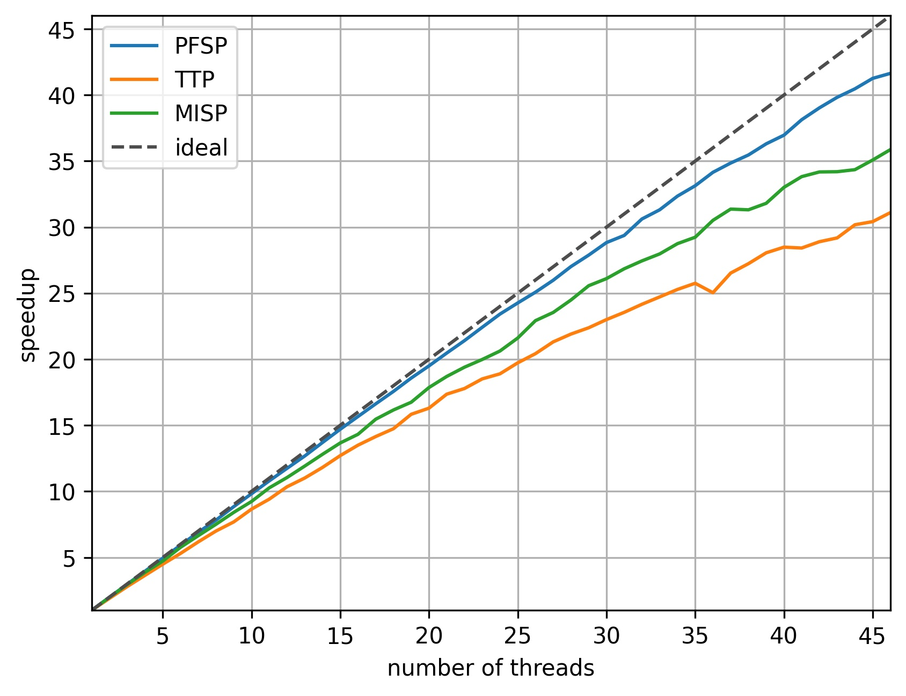

# parbeam.jl: Parallel Beam Search for Combinatorial Optimization

parbeam.jl is a parallel beam search framework in the Julia language for solving combinatorial optimization problems.

Beam search is a constructive heuristic search algorithm that traverses a state graph for a given problem instance in a truncated breadth-first-search manner. The nodes in this graph correspond to states of the search, determining the feasible extensions to the terminal nodes. The paths from the root node to any node encode partial solutions for given problem instance. In every layer, only the β best search nodes corresponding to the states are kept according to an evaluation function, the *guidance* of the beam search. This keeps the number of nodes to be evaluated polynomially bounded. It terminates after all terminal nodes, those corresponding to complete solutions, have been checked and returns a solution with the best solution quality according to an objective function.

We implement a data-parallelism friendly variant, where for a given layer the guidance value for all successors is calculated by incremental evaluation. Afterwards, the β best are selected using a histogramming approach, similar to counting sort. The actual expansions of only these successors are then performed, which are then placed on the subsequent layer. In the final step of the iteration, this layer is checked for terminal nodes, to maintain the currently best one, which is returned in the end. The algorithm terminates, when no more successors have been created and returns the best terminal, or "no feasible solution found".

An optional step is to filter the nodes in the layer, searching for duplicate states to detect isomorphism and to subsequently reduce redundancies in the search.

The framework implements this algorithm on an abstract level and requires the problem specific definition of:
* the concrete data types for problem instances, search nodes and incremental successors,
* the parsing and preprocessing of an instance,
* the initializiation of the root node,
* the incremental evaluation of a successors,
* the copying of a node and transition method acting up a node to create a successor in the next layer,
* and the detection of a terminal node.

Optionally it requires the implementation of a node hash function, which is used to detect duplicate states.

An important design choice of the implementation is that we use a fixed memory layout to heavily reduce the usage of dynamic memory allocation/garbage collection. We found this to be necessary to achieve high parallel efficiency in Julia. A consequence is that a search node has a instance-dependent layer-independent fixed length.

## Example Usage: 

The framework has been tested with Julia 1.7. It depends on the MPI and the corresponding Julia module for distributing multiple beam search runs among workers. Further modules may be necessary for the concrete problems. Three different problems have been implemented, the permutation flow shop problem (PFSP) with flowtime objective, the traveling tournament problem (TTP), and the maximum independent set problem (MISP).

All the code is located in the src directory of the repository.

The command line parameters are:

> Usage: parbeam_problem.jl <instance> <beam_width> <guidance_function> <depth_for_subtree_splitting> <number-of-runs> <sigma_rel> <variable_ordering> <successor-creation-load-balancing> <duplicate-states-filtering>

* instance: problem instance by name, instances in insts subdirectory, paths/suffixes hard-coded
* beam_width: maximum number of search nodes in layer
* guidance_function: maps from node to real, to evaluate and rank search nodes
* depth_for_subtree_splitting: search tree is split by enumerating all subtrees up to a certain depths and starting from the correspond nodes separate beam search runs
* number_of_runs: how many runs on given instance, meaningful when using randomization
* sigma_rel: relative standard deviation, adds gaussian noise to guidance function based on root lower bound
* variable_ordering: each node/layer corresponds to a decision variable
* successor-creation-load-balancing: if there is some asymmetry in the search tree, balancing of successwors might be necessary to assign approximately equal work to thread
* duplicate-states-filtering: search nodes in a layer may correspond to the same state, the ones with the worse rank could be removed in this case to avoid exploring isomorphic subtrees

One example beam search run with four threads on a PFSP VFR instance is performed by:

> JULIA_EXCLUSIVE=1 julia --threads=4 parbeam_pfsp.jl VFR100_60_1 10000 flow_time_bound_and_idle_time 0 1 0.0 lex none none

In the output, the objective value (here: flowtime) and solution (here: schedule, ordering of jobs) is given:

> [ Info: minimum objective and solution: (651337.0, [24, 12, 49, 65, 10, 38, 52, 76, 16, 85, 99, 92, 97, 23, 60, 96, 75, 46, 93, 72, 82, 13, 79, 94, 74, 6, 58, 47, 48, 77, 19, 43, 86, 29, 15, 81, 34, 87, 32, 66, 91, 90, 17, 1, 21, 61, 8, 64, 68, 71, 18, 51, 33, 80, 63, 84, 53, 28, 83, 69, 95, 11, 22, 4, 70, 39, 42, 73, 20, 35, 50, 67, 57, 88, 98, 100, 7, 59, 9, 26, 36, 27, 56, 25, 44, 54, 3, 78, 40, 2, 31, 30, 89, 37, 5, 45, 14, 62, 41, 55])
